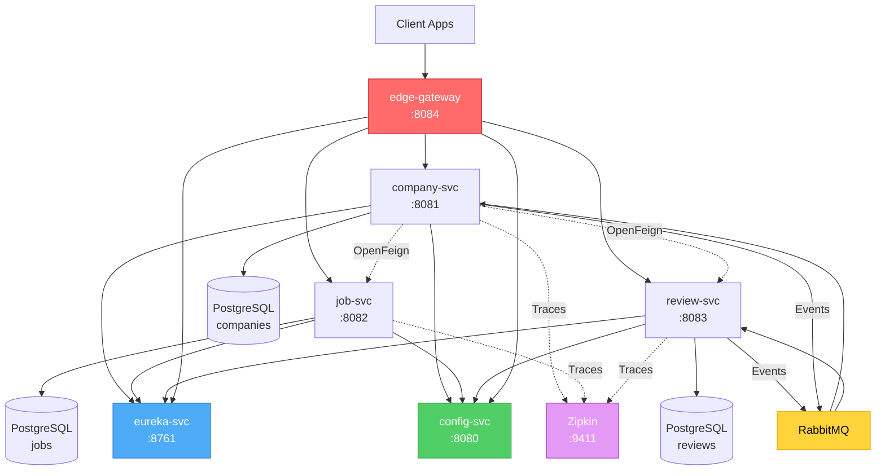

<div align="center">

# 🕸️ hiremesh

**Production-grade microservices architecture for job platforms**

[](https://spring.io/projects/spring-boot)
[](https://spring.io/projects/spring-cloud)
[](https://opensource.org/licenses/MIT)
[](http://makeapullrequest.com)

*Building hiring platforms the way Netflix builds streaming platforms*

[Architecture](#-architecture) • [Quick Start](#-quick-start) • [Services](#-service-catalog) • [Observability](#-observability--resilience) • [Deploy](#-deployment)

</div>

---

## 🎯 What is hiremesh?

**hiremesh** is a **learning-optimized**, **portfolio-grade** backend demonstrating how modern companies architect job platforms at scale.

This isn't a toy project. It's a **reference implementation** of:
- ✅ Microservices with clear bounded contexts
- ✅ Event-driven architecture (async messaging)
- ✅ Service mesh patterns (discovery, config, gateway)
- ✅ Observability-first design (tracing, metrics)
- ✅ Resilience patterns (circuit breakers, retries)

> **Think:** LinkedIn's job platform architecture, but explained for engineers who want to *actually understand* how it works.

---

## 🏗️ Architecture

### Service Topology



### Communication Patterns

| Pattern | Use Case | Implementation |
|---------|----------|----------------|
| **Sync (Request/Response)** | Read aggregation | OpenFeign (Company → Jobs/Reviews) |
| **Async (Event-Driven)** | Cross-service updates | RabbitMQ + Spring AMQP |
| **Service Discovery** | Dynamic routing | Eureka (Netflix OSS) |
| **Centralized Config** | Environment-agnostic deploys | Spring Cloud Config |
| **Distributed Tracing** | Request flow visualization | Micrometer + Zipkin |

### Event Flows

#### 📝 Review Lifecycle
```
[Review Created/Updated/Deleted]
    ↓
  RabbitMQ Event
    ↓
  Company Service
    ↓
  Recalculates avg rating + review count
    ↓
  Stores aggregate in DB
```

#### 🏢 Company Deletion
```
[Company Deleted]
    ↓
  RabbitMQ Event
    ↓
  Review Service
    ↓
  Deletes all associated reviews
    ↓
  Emits ReviewDeleted events (triggers cascades)
```

---

## 📦 Service Catalog

<table>
<thead>
  <tr>
    <th>Service</th>
    <th>Port</th>
    <th>Purpose</th>
    <th>Tech Stack</th>
  </tr>
</thead>
<tbody>
  <tr>
    <td><strong>edge-gateway</strong></td>
    <td>8084</td>
    <td>API Gateway (single entry point)</td>
    <td>Spring Cloud Gateway (WebFlux)</td>
  </tr>
  <tr>
    <td><strong>company-svc</strong></td>
    <td>8081</td>
    <td>Company CRUD + review aggregates</td>
    <td>Spring Boot + JPA + PostgreSQL</td>
  </tr>
  <tr>
    <td><strong>job-svc</strong></td>
    <td>8082</td>
    <td>Job postings management</td>
    <td>Spring Boot + JPA + PostgreSQL</td>
  </tr>
  <tr>
    <td><strong>review-svc</strong></td>
    <td>8083</td>
    <td>Reviews + event publishing</td>
    <td>Spring Boot + JPA + RabbitMQ</td>
  </tr>
  <tr>
    <td><strong>eureka-svc</strong></td>
    <td>8761</td>
    <td>Service registry & discovery</td>
    <td>Eureka Server (Netflix OSS)</td>
  </tr>
  <tr>
    <td><strong>config-svc</strong></td>
    <td>8080</td>
    <td>Centralized configuration</td>
    <td>Spring Cloud Config</td>
  </tr>
</tbody>
</table>

### Infrastructure Components

| Component | Port(s) | Purpose |
|-----------|---------|---------|
| **PostgreSQL** | 5432 | Persistent storage (one DB per service) |
| **RabbitMQ** | 5672 / 15672 | Event bus + Management UI |
| **Zipkin** | 9411 | Distributed tracing UI |
| **pgAdmin** | 5050 | Database admin interface |

---

## 🚀 Quick Start

### Prerequisites
```bash
# Required
- Docker + Docker Compose
- Git

# Optional (for local dev without Docker)
- Java 17+
- Maven 3.8+
```

### Option 1: Full Stack (Docker Compose) — **Recommended**

```bash
# Clone the repo
git clone https://github.com/saadhtiwana/hiremesh.git
cd hiremesh

# Start everything
docker-compose up --build

# Watch logs
docker-compose logs -f
```

**🌐 Access Points:**
- **Eureka Dashboard:** http://localhost:8761 (see all registered services)
- **Zipkin Traces:** http://localhost:9411 (visualize request flows)
- **RabbitMQ Management:** http://localhost:15672 (user: `guest` / pass: `guest`)
- **pgAdmin:** http://localhost:5050 (db explorer)
- **API Gateway:** http://localhost:8084 (your API entry point)

### Option 2: Local Development (Maven)

```bash
# 1. Start infrastructure only
docker-compose up postgres rabbitmq zipkin -d

# 2. Start services in order
cd eureka-svc && mvn spring-boot:run -Dspring-boot.run.profiles=dev &
cd ../config-svc && mvn spring-boot:run -Dspring-boot.run.profiles=dev &
cd ../company-svc && mvn spring-boot:run -Dspring-boot.run.profiles=dev &
cd ../job-svc && mvn spring-boot:run -Dspring-boot.run.profiles=dev &
cd ../review-svc && mvn spring-boot:run -Dspring-boot.run.profiles=dev &
cd ../edge-gateway && mvn spring-boot:run -Dspring-boot.run.profiles=dev &
```

---

## 🧪 Testing the System

### Health Checks
```bash
# Check if all services registered with Eureka
curl http://localhost:8761/eureka/apps | grep -i "<app>"

# Gateway health
curl http://localhost:8084/actuator/health
```

### Sample API Calls (via Gateway)
```bash
# Create a company
curl -X POST http://localhost:8084/companies \
  -H "Content-Type: application/json" \
  -d '{"name": "TechCorp", "description": "AI Startup"}'

# Create a job
curl -X POST http://localhost:8084/jobs \
  -H "Content-Type: application/json" \
  -d '{"title": "Senior Backend Engineer", "companyId": 1}'

# Create a review (triggers event to update company rating)
curl -X POST http://localhost:8084/reviews \
  -H "Content-Type: application/json" \
  -d '{"companyId": 1, "rating": 4.5, "comment": "Great culture!"}'

# Get company with aggregated rating
curl http://localhost:8084/companies/1
```

### Observe Event Flow
1. Open **RabbitMQ Management UI** → Queues
2. Create a review via API
3. Watch `reviewQueue` get a message
4. Check **Zipkin** → see the trace span from `review-svc` → `company-svc`

---

## 🔭 Observability & Resilience

### Distributed Tracing (Zipkin)

Every request gets a **trace ID** that follows it across services:

```
edge-gateway → company-svc → job-svc
                           ↘
                            review-svc
```

Open **Zipkin** → Search by service → See latency breakdown per hop.

### Resilience Patterns (Resilience4j)

Configured where needed:
- **Circuit Breaker:** Fail fast if downstream service is down
- **Retry:** Auto-retry transient failures
- **Rate Limiter:** Prevent resource exhaustion

Example (in `company-svc`):
```yaml
resilience4j:
  circuitbreaker:
    instances:
      companyBreaker:
        slidingWindowSize: 10
        failureRateThreshold: 50
```

---

## ☸️ Deployment

### Kubernetes

Manifests are in `deploy/kubernetes/`:

```bash
# 1. Create namespace
kubectl apply -f deploy/kubernetes/namespace.yaml

# 2. Deploy infrastructure
kubectl apply -f deploy/kubernetes/postgres/
kubectl apply -f deploy/kubernetes/rabbitmq/
kubectl apply -f deploy/kubernetes/zipkin/

# 3. Deploy services
kubectl apply -f deploy/kubernetes/bootstrap/company-svc/
kubectl apply -f deploy/kubernetes/bootstrap/job-svc/
kubectl apply -f deploy/kubernetes/bootstrap/review-svc/

# 4. Expose gateway
kubectl port-forward svc/edge-gateway 8084:8084 -n hiremesh
```

### Production Checklist

Before deploying to prod:

- [ ] Replace default passwords in `docker-compose.yaml`
- [ ] Use specific image tags (no `latest`)
- [ ] Enable HTTPS (TLS termination at gateway)
- [ ] Set resource limits (CPU/memory) in K8s
- [ ] Add health checks for all services
- [ ] Configure log aggregation (ELK/Loki)
- [ ] Set up metrics (Prometheus + Grafana)
- [ ] Add authentication (OAuth2/JWT)
- [ ] Implement rate limiting at gateway
- [ ] Add API documentation (Swagger/OpenAPI)

---

## 📂 Repository Structure

```
hiremesh/
├── edge-gateway/          # API Gateway (Spring Cloud Gateway)
├── company-svc/           # Company domain service
├── job-svc/               # Job domain service
├── review-svc/            # Review domain service
├── eureka-svc/            # Service registry (Eureka)
├── config-svc/            # Config server (Spring Cloud Config)
├── deploy/
│   └── kubernetes/        # K8s manifests
├── scripts/               # DB init scripts
├── pgadmin/               # pgAdmin config
├── docker-compose.yaml    # Local stack orchestration
└── README.md
```

---

## 🗺️ Roadmap

Future enhancements (PRs welcome!):

- [ ] **Authentication Service** (JWT/OAuth2 with Spring Security)
- [ ] **Centralized Logging** (ELK Stack or Grafana Loki)
- [ ] **Metrics Dashboard** (Prometheus + Grafana)
- [ ] **Saga Pattern** (distributed transactions with compensation)
- [ ] **API Documentation** (Swagger UI per service)
- [ ] **Contract Testing** (Spring Cloud Contract)
- [ ] **Chaos Engineering** (Chaos Monkey for Spring Boot)
- [ ] **GraphQL Gateway** (as alternative to REST)

---

## 🤝 Contributing

Contributions are welcome! Here's how:

1. Fork the repo
2. Create a feature branch (`git checkout -b feature/amazing-feature`)
3. Commit your changes (`git commit -m 'Add amazing feature'`)
4. Push to the branch (`git push origin feature/amazing-feature`)
5. Open a Pull Request

---

## 📚 Learning Resources

Want to dive deeper? Check these out:

- [Spring Cloud Documentation](https://spring.io/projects/spring-cloud)
- [Microservices Patterns (Chris Richardson)](https://microservices.io/patterns/index.html)
- [Domain-Driven Design](https://martinfowler.com/bliki/DomainDrivenDesign.html)
- [12-Factor App Methodology](https://12factor.net/)
- [Building Microservices (Sam Newman)](https://www.oreilly.com/library/view/building-microservices-2nd/9781492034018/)

---

## 📜 License

This project is licensed under the **MIT License** - see the [LICENSE](LICENSE) file for details.

---

## 💬 Questions?

- **Issues:** [GitHub Issues](https://github.com/saadhtiwana/hiremesh/issues)
- **Discussions:** [GitHub Discussions](https://github.com/saadhtiwana/hiremesh/discussions)
- **Contact:** [@saadhtiwana](https://github.com/saadhtiwana)

---

<div align="center">

**Built with ☕ by [Saad Tiwana](https://github.com/saadhtiwana)**

⭐ Star this repo if you found it helpful!

</div>