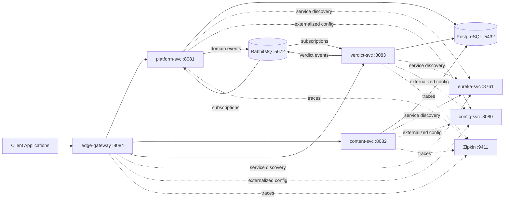

<div align="center">

# REDACTD

### A production-style moderation platform built for real-world distributed systems engineering

[](https://spring.io/projects/spring-boot)
[](https://spring.io/projects/spring-cloud)
[](https://www.oracle.com/java/)
[](https://www.postgresql.org/)
[](https://www.rabbitmq.com/)
[](https://zipkin.io/)

[Why This Project](#why-this-project) · [Architecture](#architecture) · [Services](#service-catalog) · [Run It](#quick-start) · [Deployment](#deployment) · [Roadmap](#roadmap)

</div>

---

## Why This Project

`redactd` is not a toy CRUD app. It is a complex backend that demonstrates how modern moderation systems are built when correctness, scale, and operability matter.

It combines:

- Clear domain boundaries with independently deployable services
- Mixed communication patterns (sync REST + async events)
- Operational essentials (discovery, centralized config, tracing)
- An architecture that stands up in serious technical reviews

This repository is designed to communicate engineering maturity quickly and clearly.

## System Design Principles

- **Domain ownership first:** each service owns its model and lifecycle
- **Async where it counts:** event-driven updates for cross-service consistency
- **Observability by design:** traces are first-class, not post-fix tooling
- **Failure-aware architecture:** built for partial failure, not happy-path demos
- **Deployment-ready structure:** local Docker and Kubernetes manifests included

## Architecture



## Moderation Pipeline

```text
1) Content enters through content-svc
2) Verdict decisions are created/updated in verdict-svc
3) Domain events are emitted to RabbitMQ
4) platform-svc consumes events and updates aggregate moderation metrics
5) Aggregated state is exposed through gateway-facing APIs
```

This workflow demonstrates eventual consistency with explicit business events, which is the right tradeoff for scalable moderation workloads.

## Service Catalog

| Service | Port | Role |
| --- | ---: | --- |
| `edge-gateway` | 8084 | Single ingress, routing, edge concerns |
| `platform-svc` | 8081 | Platform metadata and moderation aggregates |
| `content-svc` | 8082 | Content ingestion and lifecycle management |
| `verdict-svc` | 8083 | Moderation verdict lifecycle and event publishing |
| `config-svc` | 8080 | Centralized configuration management |
| `eureka-svc` | 8761 | Service registration and discovery |

### Supporting Infrastructure

| Component | Port(s) | Role |
| --- | ---: | --- |
| PostgreSQL | 5432 | System of record |
| RabbitMQ | 5672, 15672 | Event broker and management UI |
| Zipkin | 9411 | Distributed tracing |
| pgAdmin | 5050 | Database administration UI |

## Quick Start

### Prerequisites

- Docker and Docker Compose
- Java 17+
- Maven 3.8+

### Clone and Run Full Stack

```bash
git clone https://github.com/<your-username>/redactd.git
cd redactd
docker compose up --build
```

### Local Endpoints

- Gateway: http://localhost:8084
- Eureka Dashboard: http://localhost:8761
- Zipkin: http://localhost:9411
- RabbitMQ Management: http://localhost:15672
- pgAdmin: http://localhost:5050

## Local Development Workflow

Start infrastructure:

```bash
docker compose up postgres rabbitmq zipkin pgadmin -d
```

Start services (recommended order):

```bash
cd eureka-svc && mvn spring-boot:run
cd ../config-svc && mvn spring-boot:run
cd ../platform-svc && mvn spring-boot:run
cd ../content-svc && mvn spring-boot:run
cd ../verdict-svc && mvn spring-boot:run
cd ../edge-gateway && mvn spring-boot:run
```

## API Smoke Tests

```bash
# 1) create platform
curl -X POST http://localhost:8084/platforms \
  -H "Content-Type: application/json" \
  -d '{"name":"CreatorHub","type":"FORUM","description":"high-volume moderation domain"}'

# 2) create content
curl -X POST http://localhost:8084/contents \
  -H "Content-Type: application/json" \
  -d '{"platformId":1,"title":"Sample Post","body":"Flagged content candidate","authorId":"user_42","flagReason":"abuse","severity":"HIGH"}'

# 3) create verdict
curl -X POST "http://localhost:8084/verdicts?platformId=1" \
  -H "Content-Type: application/json" \
  -d '{"contentId":1,"decision":"REMOVED","moderatorNote":"policy violation","reasoning":"guideline-4"}'

# 4) verify aggregate view
curl http://localhost:8084/platforms/1
```

## Observability

Tracing is integrated across gateway and core services.

Use Zipkin to validate cross-service execution paths and latency boundaries:

```text
edge-gateway -> platform-svc -> content-svc
                          -> verdict-svc
```

This makes runtime behavior inspectable and auditable in real engineering reviews.

## Deployment

Kubernetes manifests are available under `deploy/kubernetes`.

```bash
# namespace
kubectl apply -f deploy/kubernetes/namespace.yaml

# infrastructure
kubectl apply -f deploy/kubernetes/postgres/
kubectl apply -f deploy/kubernetes/rabbitmq/
kubectl apply -f deploy/kubernetes/zipkin/

# services
kubectl apply -f deploy/kubernetes/bootstrap/platformms/
kubectl apply -f deploy/kubernetes/bootstrap/contentms/
kubectl apply -f deploy/kubernetes/bootstrap/verdictms/
```

## Recent Updates (Latest Release)

**v2.0.0** — Architecture Modernization & Engineering Excellence

- **Spring Boot Upgrade:** Updated from 3.5.6 to 3.5.12 LTS with latest security patches
- **Spring Cloud 2025.0.0:** Latest microservices orchestration framework
- **Namespace Migration:** Removed legacy "jobapp" naming → unified under `com.redactd` package structure
- **Mapper Refactoring:** Migrated from MapStruct annotations to explicit Spring `@Component` mapper implementation for improved control and testability
- **Database Alignment:** Corrected database names across all layers:
  - `platform_db` for platform service
  - `content_db` for content service
  - `verdict_db` for verdict service
- **Kubernetes Manifests Audit:** Updated service naming and configuration references for consistency
- **Dependency Management:** Leveraged Spring Cloud BOM for simplified, conflict-free dependency versioning
- **Verified Compilation:** All modules compile successfully with zero warnings (`BUILD SUCCESS`)


## Production Hardening Checklist

- [ ] Replace development credentials and secrets
- [ ] Pin immutable image tags
- [ ] Enforce TLS at the edge
- [ ] Set CPU and memory requests/limits per service
- [ ] Add authentication and authorization (JWT/OAuth2)
- [ ] Add metrics stack (Prometheus/Grafana)
- [ ] Add centralized logs (ELK/Loki)
- [ ] Add service-level alerts and SLOs

## Repository Structure

```text
redactd/
|-- edge-gateway/
|-- platform-svc/
|-- content-svc/
|-- verdict-svc/
|-- eureka-svc/
|-- config-svc/
|-- deploy/kubernetes/
|-- scripts/
|-- pgadmin/
|-- docker-compose.yaml
`-- README.md
```

## Roadmap

- [ ] Auth service with RBAC-aware moderation actions
- [ ] Idempotent consumers and dead-letter queue strategy
- [ ] Contract testing for service APIs and events
- [ ] Policy engine integration for rule-based moderation
- [ ] CI pipeline with quality gates and deployment promotion

## Contributing

High-quality contributions are welcome.

1. Create a focused branch.
2. Keep service boundaries explicit.
3. Preserve event contracts and payload compatibility.
4. Add verification notes (commands and expected results).

## Final Note

`redactd` is built to signal engineering readiness: thoughtful boundaries, observable behavior, and architecture decisions that hold up under scrutiny.

The codebase is organized so implementation quality and systems thinking are visible at a glance.